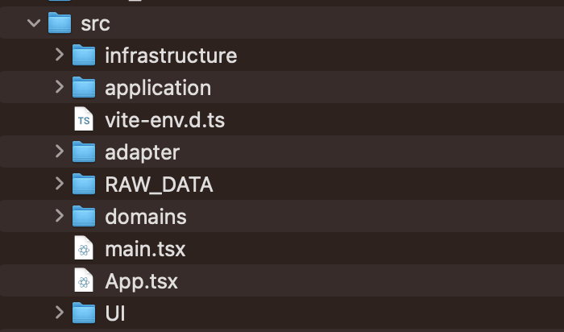
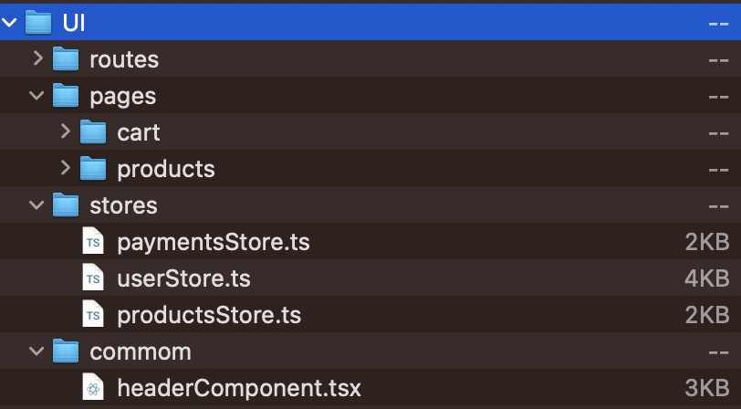

# Clean Code, 폴더 구조 | 우리가 고려하면 좋은 것들

안녕하세요.

이번 발표에서는 Clean Code, 폴더구조 등 우리가 프로젝트를 하면서 한번쯤은 고려하게 될 부분에 대해 다뤄보려고 합니다.

시간이 짧고 다루는 주제가 많다보니 최대한 가볍고 쉽게 훑고 넘어가 볼게요. 🙂

## Clean Code?

개발자들은 우아한코드, 깨끗한 코드 라는 말을 많이 씁니다.<br/>
깨끗한 코드가 의미하는 바는 뭘까요?

> <br/> “I like my code to be elegant and efficient. The logic should be straightforward and make it hard for bugs to hide, the dependencies minimal to ease maintenance, error handling complete according to an articulated strategy, and performance close to optimal so as not to tempt people to make the code messy with unprincipled optimizations. Clean code does one thing well.”
<br/><br/> **Bjarne Stroustrup, inventor of ‘C++** <br/><br/>
"저는 제 코드가 우아하고 효율적인 것이 좋습니다. 논리는 간단하고 버그를 숨기기 어렵게 만들어야 하며, 유지보수를 용이하게 하기 위해 최소한의 의존성, 명확한 전략에 따라 오류 처리가 완료되어야 하며, 사람들이 원칙 없는 최적화로 코드를 엉망으로 만들지 않도록 최적에 가까운 성능을 제공해야 합니다. 클린 코드는 한 가지를 잘 수행하는 코드 입니다.”<br/><br/>

클린코드는 유지보수와 디버깅에 용이하고 준수한 성능과 명확한 의도를 가진 코드 정도로 볼 수 있습니다.

## 일하면서 느낀 클린코드

작년 1년간 회사에서 15명정도의 개발자들과 함께 클린 코드, 클린 아키텍처에 대한 스터디를 진행하였습니다.

스터디와 프로젝트 병행했던 경험에 빗대어 보면, 제가 생각하는 클린 코드의 가장 중요한 것은 "**의도**" 입니다.

코드에서 보이는 의도가 뭘까요? 응집도, 단일책임, 추상화, SOLID 등등 여러 개념들이 있을 수 있겠죠.

제가 말하는 코드에서 보이는 의도는 말 그대로 “왜 이렇게 작성했는지 코드로 납득하게 하는 것” 입니다.

아래 두 코드를 볼까요?

```tsx
const 어떤_컴포넌트 = () => {
  const [popup, setPopup] = useState<boolean>(false);

  const handleClick = () => {
    setPopup(true);
  };

  const handlePopUpSubmit = async () => {
    await 특정_행동();
    setPopup(false);
  };

  return (
    <>
      <button onClick={handleClick}></button>
      <PopUp title="팝업 제목" open={popup}>
        <div>안녕 나는 팝업</div>
        <button onClick={handlePopUpSubmit}></button>
      </PopUp>
    </>
  );
};
```

```tsx
const 어떤_컴포넌트 = () => {
  const [openPopUp] = usePopup();

  const handleClick = async () => {
    const isPopupConfirmed: boolean = await usePopup({
      title: "팝업 제목",
      content: <div>안녕 나는 팝업</div>,
    });

    if (isPopupConfirmed) {
      await doSomething();
    }
  };

  const doSomething = async () => {
    await 특정_행동();
  };

  return <button onClick={handleClick}></button>;
};
```

첫번째의 코드는 되게 익숙하죠? 많이 사용하는 방식인 것 같습니다.

일단 `boolean`인 `popup` 이 명사형으로 되어 있어서 `props`로 전달되는 부분에서의 명시가 명확하지 않아 보입니다.<br/>
또한 `handle prefix`로 묶여있는 `function`들도 무엇을 하는 함수인지 꼭 내부를 모두 읽어봐야 알 수 있습니다.<br/>
UI에서는 `<PopUp/>`의 세부구현까지 명시가 되어있는 모습이네요. 팝업의 기능을 알기위해 컴포넌트를 전부 읽어야 합니다.

두번째 코드를 한 번 볼까요?

popup을 사용하는 코드는 `usePopup` 훅을 통해서 세부 구현을 감추게 되었습니다.<br/>
굳이 popup이 어떻게 구현되어 있고, 어떤 UI 를 가지고 있는지는 이 컴포넌트에서 확인할 필요가 없는거죠. 덕분에 UI 까지 가지 않아도 로직 구현부에서 팝업의 내용을 함축적으로 전달받을 수 있습니다.<br/>
`boolean` 도 `isPopupConfirmed` 와 같이 조금 더 서술적이 네이밍으로 변경되어 조건문 안에 들어갔을 때 더욱 명확한 판단이 가능해진 모습입니다.<br/>

지금은 비단 아주 간단한 컴포넌트 하나이지만 기능이 많아지고 복잡해지면 어떨까요? 팝업이 여러개가 된다면? 팝업의 행동의 개수가 늘어난다면?<br/>
첫번째 코드의 `handle function`은 점점 거대하고 여러개의 일을하는 짬뽕 코드가 될 확률이 높겠죠?<br/>
반면에 기능단위로 나위어진 두번째 코드는 디버깅, 확장등에 유리한 이점을 가질 것입니다.

이처럼 내가 어떠한 결정에 의해서 코드를 작성했는지 쉽게 코드에서 보일 수 있도록 하는 것이 상당히 중요합니다.

이건 비단 FE 내부에서 뿐만 아니라 BE 와 함께 웹 서버의 controller interface를 정의할때, 기획자와 기술에 대한 이야기를 풀어나갈때 등 의도를 표현한 것과 그렇지 않았던 것에 차이는 확연히 드러났었습니다.

저의 클린 코드 이야기는 **의도**라는 단어로 함축해보고, 자세한 클린 코드에 대한 이야기는 "Clean Code" 도서 혹은 수많은 컨퍼런스 자료들을 추가로 찾아보시는 것을 추천드립니다.

## 폴더 구조

클린 코드 이야기 하다가 갑자기 폴더 구조? 하고 의아해 하실수도 있을 것 같습니다.

하지만 함께 일할때 본인의 의도를 표현할때 이만큼 좋은것도 없습니다.

폴더구조는 코드를 보지 않고도 의도를 표현할 수 있고 구현과 기술적인 한계 등의 큰 고민없이 의도를 담을 수 있습니다.<br/>
또한 git 은 파일 단위로 diff를 하기때문에 명확한 파일의 분리는 협업 시 코드 충돌이 나지 않도록 위계를 정하고 룰을 정하기 용이합니다.

일단 폴더구조 먼저 한 번 봐볼까요? 아래 두 폴더 구조가 있습니다.

```tsx
common /
  Avatar.js;
  Avatar.css;
  APIUtils.js;
  APIUtils.test.js;
feed /
  index.js;
  Feed.js;
  Feed.css;
  FeedStory.js;
  FeedStory.test.js;
  FeedAPI.js;
profile /
  index.js;
  Profile.js;
  ProfileHeader.js;
  ProfileHeader.css;
  ProfileAPI.js;
```

```tsx
  api /
  APIUtils.js;
  APIUtils.test.js;
  ProfileAPI.js;
  UserAPI.js;
components /
  Avatar.js;
  Avatar.css;
  Feed.js;
  Feed.css;
  FeedStory.js;
  FeedStory.test.js;
  Profile.js;
  ProfileHeader.js;
  ProfileHeader.css;
```

첫번째 구조는 도메인 단위, 두번는 기능 단위로 분리가 된 것으로 보입니다.<br/>
이 두 폴더 구조는 react 에서 추천하는 폴더 스트럭처 입니다. 작은 프로젝트에서는 충분해 보입니다. 그런데 점점 구조가 복잡해지고 많아지면 어떨까요? 두번째 구조를 예로 들어 봅시다.

```tsx
api /
  APIUtils.js;
  APIUtils.test.js;
  ProfileAPI.js;
  UserAPI.js;
  SnsApi.js;
  Payment.js;
  Board.js;
  Story.js;

components /
  Avatar.js;
  Avatar.css;
  Feed.js;
  Feed.css;
  FeedStory.js;
  FeedStory.test.js;
  Profile.js;
  ProfileHeader.js;
  ProfileHeader.css;
  Sns.js;
  Sns.css;
  Board.js;
  Board.css;
  Story.js;
  Story.test.js;
  Payment.js;
  PaymentHeader.js;
  PaymentHeader.css;
```

조금만 추가했는데 벌써 머리가 살짝 아파옵니다.<br/>
이 코드 구조를 내가 아닌 다른 사람 혹은 1~2년 뒤에 내가 알아볼 수 있을까? 라고 생각하면 글쎄요… 조금은 어려울 수도 있을 것 같네요 :<

아래 폴더 구조는 제가 이번에 이직을 준비하면서 과제, 기술 면접에 합격한 기업에 제출했던 프로젝트의 폴더 구조입니다.




도메인으로 명확하게 분리 하려고 노력했고 UI도 따로 분리해서 예시보다는 깊은 구조로 나눠놓은 모습입니다.<br/>
논리적으로 코드를 모으고 분리를 해놓았기 때문에 함께 일하는 사람들은 의도에 따라 원하는 폴더, 코드 베이스에서 작업하기 용이해집니다.

물론 언제나 정답인 구조? 그런건 없습니다.<br/>
그러나 나의 의도를 담은 구조만 있을 뿐이고 그것만 충족하면 어떠한 구조를 사용해도 충분하다고 생각합니다.

## 은빛 탄환은 없다.

> <br/>**No Silver Bullet – Fred Brooks**<br/><br/>

소프트웨어 개발의 복잡성을 일거에 해소할 **은빛 탄환** (괴물 늑대인간을 마법처럼 잠재울 수단) 같은 방법은 없다. 라는 유명한 논문입니다.

결국 개발자는 코드로 대화하는 사람들이고 코드를 작성하는 것은 에세이를 작성하는 것과 비슷하다고 생각합니다.<br/>
계속해서 수정하고, 의도를 명확히하고 코드에 대해 고민하는 시간이 필요합니다.

제가 이번 발표에서 여러분 모두에게 제안드리고 싶은 내용은<br/>
**나의 의도를 온전히 코드에 담는 노력을 해보자!** 입니다.

Github 을 사용하면서 내가 작성한 이 코드를 어떻게 모두에게 전부 전달 할 수 있을지 생각하고<br/>리뷰를 할때도 “이 사람의 의도는 뭐지? 더 좋은 방식은 없었을까?” 생각하며 바라봐주시면<br/>우리가 앞으로 있을 프로젝트 기간 동안 더욱 많은 것을 배워갈 수 있을 것이라고 생각합니다.

많은 내용을 담으려다보니까 조금은 중구난방해진 기분이네요<br/>
그래도 끝까지 봐주셔서 감사합니다! :D
